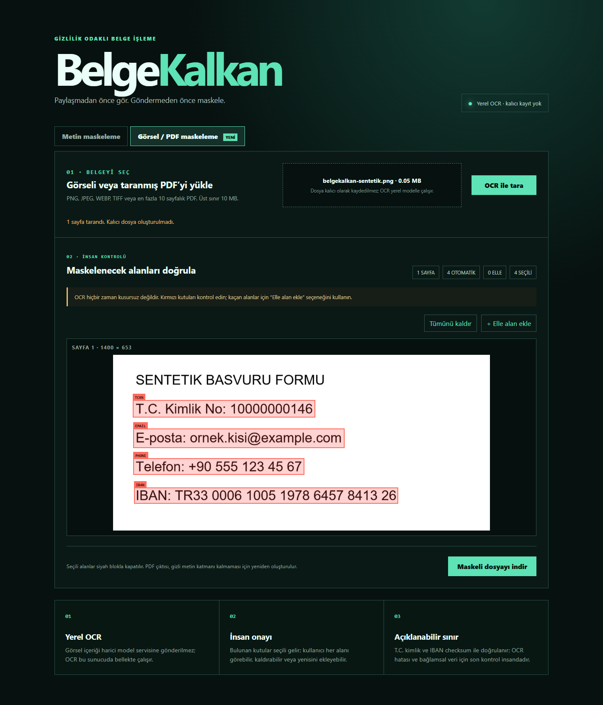

# BelgeKalkan

[](https://github.com/cantsdlnn/belge-kalkan/actions/workflows/ci.yml)

[English summary](README.en.md)

Türkçe metinlerde, belge ekran görüntülerinde ve taranmış PDF'lerdeki T.C. kimlik numarası, Türkiye IBAN'ı, e-posta ve mobil telefon gibi kişisel verileri **harici bir servise göndermeden** bulup maskeleyen web servisi; metinler için ayrıca komut satırı aracı.



## Neden bu proje?

Hata kaydı, destek talebi veya taranmış belge paylaşılırken gerçek kişisel bilgiler kolayca içerikte kalabiliyor. BelgeKalkan paylaşım öncesinde otomatik bir ilk kontrol sağlar; yerel OCR ile görseldeki yazı bölgelerini çıkarır, T.C. kimlik ve IBAN adaylarını sağlama toplamıyla doğrular, kullanıcıya maske kutularını onaylatır ve ham değeri kalıcı olarak tutmaz.

## Öne çıkan özellikler

- T.C. kimlik numarası için resmî sağlama algoritması
- Türkiye IBAN'ı için ISO 13616 mod-97 kontrolü
- E-posta ve Türkiye mobil telefon biçimleri
- PNG, JPEG, WEBP, TIFF ve 10 sayfaya kadar taranmış PDF desteği
- RapidOCR + ONNX Runtime ile yerel OCR; harici model API'si yok
- Bulunan bölgeleri kutularla önizleme, tek tek seçme ve elle maske alanı ekleme
- Maskelenmiş PNG veya yeniden oluşturulmuş, düzleştirilmiş PDF indirme
- 10 MB dosya, 10 sayfa, 30 megapiksel ve 20.000 piksel kenar güvenlik sınırları
- Etiket, maske ve çekirdek serviste HMAC tabanlı kararlı token üretimi
- Ham değer içermeyen işlem manifesti ve içerik özetleri
- FastAPI arayüzü, OpenAPI belgesi ve metin maskeleme çekirdeğini kullanan CLI
- Çakışan eşleşmeleri deterministik çözme
- Test, kapsam eşiği, Ruff ve GitHub Actions CI
- Çok aşamalı olmayan, ayrıcalıksız kullanıcıyla çalışan Docker imajı

## Hızlı başlangıç

Python 3.11 veya üzeri gerekir.

```bash
python -m venv .venv
.venv\Scripts\activate
python -m pip install -e ".[dev]"
uvicorn belgekalkan.api:app --reload
```

Ardından `http://127.0.0.1:8000` adresini açın. İlk OCR işlemi modelin belleğe yüklenmesi nedeniyle sonraki taramalardan daha uzun sürebilir. API belgesi `/docs` yolundadır.

CLI örneği:

```bash
belge-kalkan ornek.txt --output guvenli.txt --manifest islem.json --mode label
```

## Test

```bash
ruff check .
pytest
```

Testler checksum doğrulamasını, yanlış pozitiflerin elenmesini, görsel/PDF yüklemeyi, koordinat ölçeklemeyi, piksel maskelemeyi, PDF'deki eski metin katmanının kaldırılmasını ve API'nin ham OCR metnini ayrı alan olarak döndürmemesini kapsar. CI ayrıca gerçek ONNX OCR motorunu çalıştırır ve Docker imajını oluşturup aynı motoru ayrıcalıksız kullanıcıyla sınar.

## Güvenlik ve dürüst sınırlar

BelgeKalkan bir ön kontrol aracıdır; bağlamı anlayan eksiksiz bir veri kaybı önleme ürünü değildir. OCR küçük, eğik veya düşük kontrastlı yazıları kaçırabilir. Ad, adres ve serbest biçimli hassas içerik gibi her kişisel veriyi bulamaz. Bu nedenle otomatik kutular kullanıcıya gösterilir, elle alan ekleme sağlanır ve çıktı paylaşılmadan önce insan kontrolü istenir.

Web katmanı veri tabanı kullanmaz; yüklenen dosya ve OCR sonucu kalıcı olarak saklanmaz. Görsel önizlemesi kullanıcının kendi tarayıcısına geri gönderilir. İnternete açık dağıtım için TLS, kimlik doğrulama, hız sınırı, geçici dosya politikası ve altyapı logları ayrıca ele alınmalıdır. Ayrıntı: [SECURITY.md](SECURITY.md).

## Proje belgeleri

- [Gereksinimler ve kabul ölçütleri](docs/requirements.md)
- [Mimari](docs/architecture.md)
- [OCR tasarımı ve insan kontrolü](docs/ocr-design.md)
- [Yapay zekâ kullanım beyanı](AI_USAGE.md)
- [Değişiklik günlüğü](CHANGELOG.md)

## AI kullanımı

Üretken yapay zekâyı tasarım seçeneklerini karşılaştırma, sınır durumlarını bulma, testleri genişletme ve dokümantasyon incelemesi için kullandım. Kural uygulaması, gizlilik sınırları ve nihai doğrulama sorumluluğu bana aittir. Çalışma zamanında üretken yapay zekâ veya harici model servisi kullanılmaz; OCR yerel ONNX modeliyle yapılır.

## Lisans

[MIT](LICENSE)
